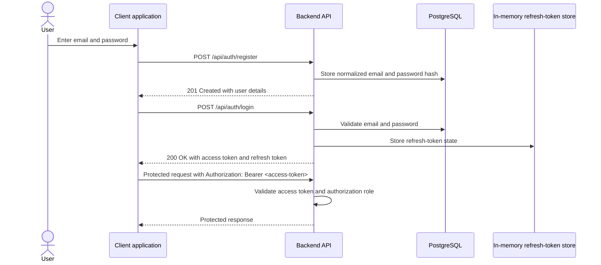
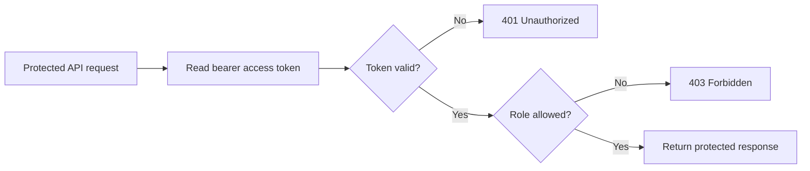
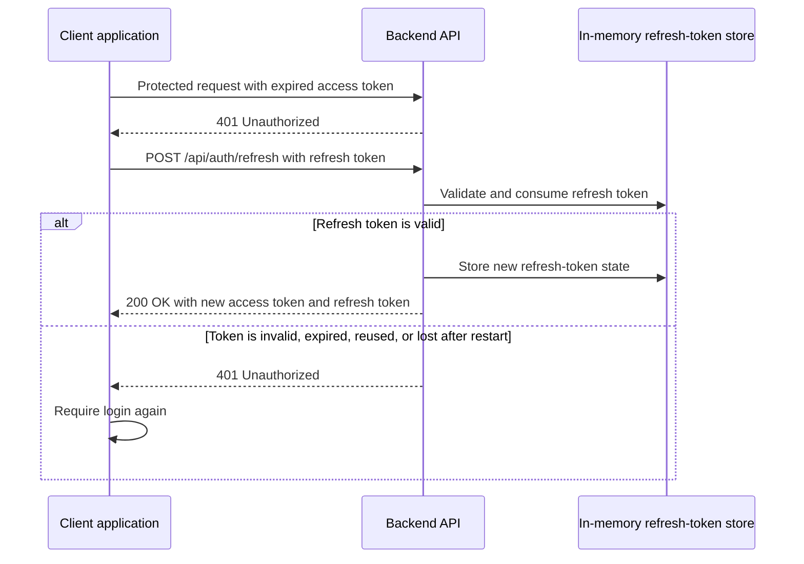

# Authentication

## Overview

The backend currently uses local email-and-password authentication. Authentication is handled by the main backend API; there is no separate authentication server.

Normal API requests are stateless. The backend does not use an HTTP session to remember the user. After login, the client receives two tokens:

- an **access token** used for protected API requests;
- a **refresh token** used to obtain a new token pair after the access token expires.

The current authentication endpoints and their exact request and response schemas are available in the [OpenAPI contract](./openapi.yaml).

## Main authentication flow

Registration and login are separate actions. Registering a user creates the account but does not log the user in automatically.



Passwords are never stored as plaintext. The backend stores a password hash in PostgreSQL and compares the submitted password against that hash during login.

Emails are normalized before storage and login checks by trimming surrounding whitespace and converting the value to lowercase.

## Tokens

| Token | Purpose | Server-side storage | Default lifetime |
| --- | --- | --- | --- |
| Access token | Authorizes protected API requests | Not stored by the backend | 15 minutes |
| Refresh token | Obtains a new token pair without logging in again | Stored in memory as a hash | 30 days |

### Access token

The access token is a signed JWT. The client sends it with protected requests:

```http
Authorization: Bearer <access-token>
```

The JWT contains the information needed for stateless authentication:

| Claim | Meaning |
| --- | --- |
| `iss` | Token issuer |
| `iat` | Time the token was issued |
| `exp` | Expiration time |
| `sub` | User ID |
| `jti` | Unique token identifier |
| `role` | Backend authorization role: `USER` or `ADMIN` |

For each protected request, the backend verifies the token signature, issuer, and expiration time. It then reads the user ID and role from the token and applies the authorization rules for the requested operation.



Access-token revocation is not currently implemented. An issued access token normally remains valid until it expires or until the signing key changes.

### Refresh token

The refresh token is an opaque random value rather than a JWT. The raw value is returned to the client. The backend stores only a hash of the token in memory.

Refresh tokens are rotated. When a refresh token is used successfully, the old token becomes invalid and the backend returns a new access token and a new refresh token.



Logout invalidates the submitted refresh token:

```text
POST /api/auth/logout
```

Logout does not invalidate access tokens that have already been issued. It also invalidates only the submitted refresh token rather than every session belonging to the user.

## Authentication endpoints

The following table provides a quick overview. See the [OpenAPI contract](./openapi.yaml) for the exact request fields, response schemas, and validation rules.

| Method | Endpoint | Access | Purpose |
| --- | --- | --- | --- |
| `POST` | `/api/auth/register` | Public | Create a local user account |
| `POST` | `/api/auth/login` | Public | Log in with email and password and receive tokens |
| `POST` | `/api/auth/refresh` | Public | Exchange a valid refresh token for a new token pair |
| `POST` | `/api/auth/logout` | Public | Invalidate one refresh token |
| `GET` | `/api/auth/me` | Authenticated | Return the current active user |

A public endpoint does not mean that the operation always succeeds. Login, refresh, and logout still validate the submitted credentials or token where applicable.

## Authorization roles

Authentication determines who the caller is. Authorization determines what the caller is allowed to do.

The backend currently has two authorization roles:

| Role | Meaning |
| --- | --- |
| `USER` | Standard authenticated user |
| `ADMIN` | Administrative user |

The current access rules are summarized below:

| API area | Public | `USER` | `ADMIN` |
| --- | ---: | ---: | ---: |
| Registration, login, refresh, and logout | Yes | Yes | Yes |
| Current user: `GET /api/auth/me` | No | Yes | Yes |
| Read campuses | Yes | Yes | Yes |
| Create, update, or delete campuses | No | No | Yes |
| User-management operations | No | No | Yes |

Any other `/api/**` route is authenticated by default unless it is explicitly made public.

## Stored data and restart behavior

| Data | Storage | Survives backend restart? |
| --- | --- | ---: |
| Users | PostgreSQL | Yes |
| Backend roles | PostgreSQL | Yes |
| Password hashes | PostgreSQL | Yes |
| Access tokens | Held by the client; not stored by the backend | Depends on signing key and expiry |
| Refresh-token hashes | Backend memory | No |
| Generated default JWT signing key | Backend memory | No |

By default, the JWT signing key is generated when the backend starts. Restarting the backend therefore invalidates both access tokens and refresh tokens in the default local setup.

A stable JWT signing secret can be configured for environments that require it. In that case, existing access tokens can remain valid until their normal expiration time after a restart. Refresh tokens are still invalidated because their server-side state is stored only in memory.

## Error behavior

| Status | Meaning |
| --- | --- |
| `400 Bad Request` | The submitted request is invalid |
| `401 Unauthorized` | Authentication is missing or failed, or a submitted token is invalid or expired |
| `403 Forbidden` | Authentication succeeded, but the caller does not have the required role |
| `409 Conflict` | Registration or user creation conflicts with an existing email address |

The backend intentionally avoids exposing detailed token-validation failures to clients.

## Known limitations and development scope

The current authentication setup is primarily intended for development. It provides the complete local registration, login, access-token, refresh-token, and logout workflows needed by the application, but it should be reviewed and hardened before production use.

Known limitations include:

* Soft-deleting a user prevents new login, refresh, and current-user requests from succeeding. However, an access token issued before deletion may remain usable until it expires for operations that rely only on the role stored in the token.
* Authentication endpoints do not currently have application-level rate limiting to reduce repeated login or registration attempts.
* Login failures use a generic response so that the client is not told whether an email address exists. Stronger protection against timing-based account discovery has not yet been verified.

The current local authentication flow does not use OAuth authorization codes. Therefore, an OAuth code challenge such as PKCE is not part of the current workflow. If a future external login flow uses authorization codes from a public Android client, PKCE or an equivalent protection must be included in that design.

## Future plans

The current local JWT setup is a development-oriented starting point. The schema already includes preparation for external identities, but external login is not implemented and the final authentication architecture has not yet been selected.

Possible future approaches include extending the current backend-issued token model or using Microsoft Entra authentication with MSAL on Android. The final design should be chosen when the external-login requirements are confirmed.

Authentication should remain isolated from the rest of the application. Backend features should depend only on the authenticated user and authorization roles, while frontend features should use a dedicated authentication and session layer. Keeping these boundaries clear will make it easier to replace or extend the authentication setup without requiring unrelated features to be refactored.
